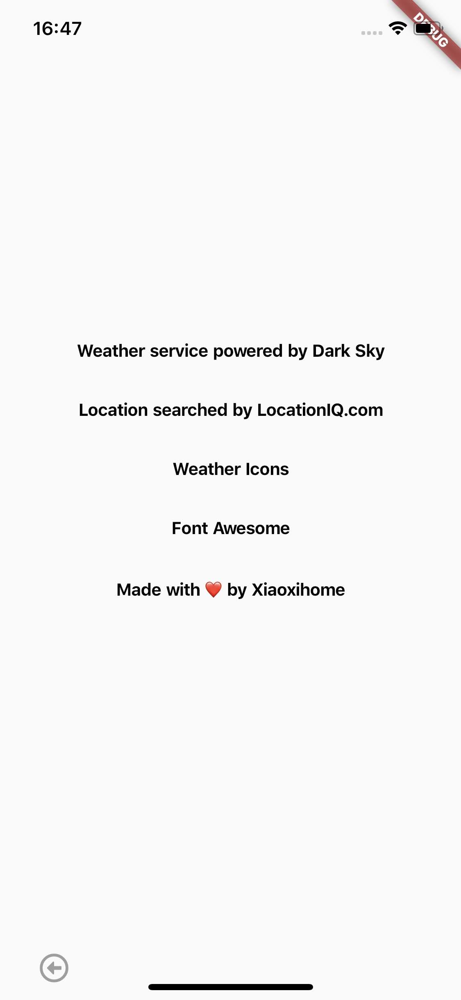

# Weather App

written with Flutter/Dart. 
Web version: https://github.com/CptDoraemon/weather 
Web version live demo: https://cptdoraemon.github.io/weather/

## Screenshots:
 \ | iOS | Android
------------ | ------------ | -------------
Weather for current location |  | 
Hourly temperature Forecast |  | 
Hourly Precipitation Forecast |  | 
Hourly Wind Forecast |  | 
Daily Forecast |  | 
Search by city |  | 
Weather for city searched |  | 
Acknowledgements |  | 

